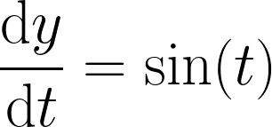
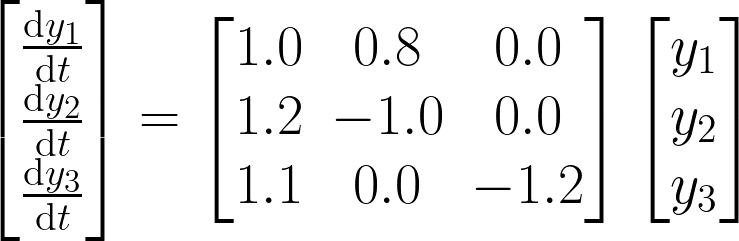

# RayBNN_DiffEq
Differential Equation Solver using GPUs, CPUs, and FPGAs via CUDA, OpenCL, and oneAPI

Requires Arrayfire and Arrayfire Rust

Supports f16, f32, f64, Complexf16, Complexf32, Complexf64

Also supports Matrix Differential Equations and Sparse Matrix Differential Equations

Matrix Sizes upto 100000x100000

# Install Arrayfire

Install the Arrayfire 3.9.0 binaries at [https://arrayfire.com/binaries/](https://arrayfire.com/binaries/)

or build from source
[https://github.com/arrayfire/arrayfire/wiki/Getting-ArrayFire](https://github.com/arrayfire/arrayfire/wiki/Getting-ArrayFire)


# Add to your Cargo.toml
```
arrayfire = { version = "3.8.1", package = "arrayfire_fork" }
num = "0.4.1"
num-traits = "0.2.16"
half = { version = "2.3.1" , features = ["num-traits"] }
raybnn_diffeq = "0.1.4"
```


# List of Examples
 - [Linear ODE with CUDA f64](#solving-a-simple-linear-ode-on-cuda-with-float-64-bit-precision) 
 - [3x3 Linear Matrix ODE with CUDA f64](#solving-a-3x3-matrix-linear-ode-on-cuda-with-float-64-bit-precision) 
 - [1000x1000 Linear Matrix ODE with CUDA f64](#solving-a-1000x1000-matrix-linear-ode-on-cuda-with-float-64-bit-precision) 
 - [Linear ODE with CUDA f32](#solving-a-simple-linear-ode-on-cuda-with-float-32-bit-precision) 
 - [Interpolating Solved Results](#interpolating-solved-results) 
 - [Selecting between CPU, OpenCL, and CUDA](#selecting-between-cpu-opencl-and-cuda) 


# Solving a Simple Linear ODE on CUDA with Float 64 bit precision


```
//cargo run --example  Linear_ODE --release

use arrayfire;
use RayBNN_DiffEq;

//Select CUDA and GPU Device 0
const BACK_END: arrayfire::Backend = arrayfire::Backend::CUDA;
const DEVICE: i32 = 0;

fn main() {

	arrayfire::set_backend(BACK_END);
	arrayfire::set_device(DEVICE);

	// Set the Linear Differentail Equation
	// dy/dt = sin(t)
	let diffeq = |t: &arrayfire::Array<f64>, y: &arrayfire::Array<f64>| -> arrayfire::Array<f64> {
		arrayfire::sin(&t) 
	};

	//Start at t=0 and end at t=1000
	//Step size of 0.001
	//Relative error of 1E-9
	//Absolute error of 1E-9
	//Error Type compute the total error of every element in y
	let options: RayBNN_DiffEq::ODE::ODE45::ODE45_Options<f64> = RayBNN_DiffEq::ODE::ODE45::ODE45_Options {
		tstart: 0.0f64,
		tend: 1000.0f64,
		tstep: 0.001f64,
		rtol: 1.0E-9f64,
		atol: 1.0E-9f64,
		error_select: RayBNN_DiffEq::ODE::ODE45::error_type::TOTAL_ERROR
	};

	let t_dims = arrayfire::Dim4::new(&[1,1,1,1]);
	let mut t = arrayfire::constant::<f64>(0.0,t_dims);

	let y0_dims = arrayfire::Dim4::new(&[1,1,1,1]);
	let mut y = arrayfire::constant::<f64>(0.0,y0_dims);
	let mut dydt = arrayfire::constant::<f64>(0.0,y0_dims);

	//Initial Point of Differential Equation
	//Set y(t=0) = 1.0
	let y0 = arrayfire::constant::<f64>(1.0,y0_dims);

	println!("Running");

	arrayfire::sync(DEVICE);
	let starttime = std::time::Instant::now();

	//Run Solver
	RayBNN_DiffEq::ODE::ODE45::solve(
		&y0
		,diffeq
		,&options
		,&mut t
		,&mut y
		,&mut dydt
	);

	arrayfire::sync(DEVICE);

	let elapsedtime = starttime.elapsed();
	
	arrayfire::sync(DEVICE);

	arrayfire::print_gen("y".to_string(), &y,Some(6));
	arrayfire::print_gen("t".to_string(), &t,Some(6));

	println!("Computed {} Steps In: {:.6?}", y.dims()[1],elapsedtime);


	//Error Analysis
	let actualy = 2.0f64 - arrayfire::cos(&t);
	let error = y - actualy;
	//arrayfire::print_gen("error".to_string(), &error,Some(6));
}
```

```
Computed 11704 Steps In: 5.444366s
```


# Solving a 3x3 Matrix Linear ODE on CUDA with Float 64 bit precision


```
//cargo run --example  Linear_Matrix_ODE --release

use arrayfire;
use RayBNN_DiffEq;

//Select CUDA and GPU Device 0
const BACK_END: arrayfire::Backend = arrayfire::Backend::CUDA;
const DEVICE: i32 = 0;

fn main() {

	arrayfire::set_backend(BACK_END);
	arrayfire::set_device(DEVICE);


	//Create A matrix
	let A_vec:Vec<f64> = vec![1.0, 1.2, 1.1,    0.8, -1.0, 0.0,    0.0, 0.0, -1.2];
	let mut A = arrayfire::Array::new(&A_vec, arrayfire::Dim4::new(&[3, 3, 1, 1]));
	arrayfire::print_gen("A".to_string(), &A,Some(6));

	//A
	//1.000000     0.800000     0.000000 
	//1.200000    -1.000000     0.000000 
	//1.100000     0.000000    -1.200000 

	// Set the Linear Matrix Differentail Equation
	// dy1/dt = 1.0y1 + 0.8y2  + 0.0y3
	// dy2/dt = 1.2y1 + -1.0y2 + 0.0y3
	// dy3/dt = 1.1y1 + 0.0y2  + -1.2y3 
	let diffeq = |t: &arrayfire::Array<f64>, y: &arrayfire::Array<f64>| -> arrayfire::Array<f64> {
		arrayfire::matmul(&A, y, arrayfire::MatProp::NONE, arrayfire::MatProp::NONE)
	};

	//Start at t=0 and end at t=10
	//Step size of 0.001
	//Relative error of 1E-9
	//Absolute error of 1E-9
	//Error Type compute the total error of every element in y
	let options: RayBNN_DiffEq::ODE::ODE45::ODE45_Options<f64> = RayBNN_DiffEq::ODE::ODE45::ODE45_Options {
		tstart: 0.0f64,
		tend: 10.0f64,
		tstep: 0.001f64,
		rtol: 1.0E-9f64,
		atol: 1.0E-9f64,
		error_select: RayBNN_DiffEq::ODE::ODE45::error_type::TOTAL_ERROR
	};

	let t_dims = arrayfire::Dim4::new(&[1,1,1,1]);
	let mut t = arrayfire::constant::<f64>(0.0,t_dims);

	let y0_dims = arrayfire::Dim4::new(&[3,1,1,1]);
	let mut y = arrayfire::constant::<f64>(0.0,y0_dims);
	let mut dydt = arrayfire::constant::<f64>(0.0,y0_dims);

	//Initial Point of Differential Equation
	//Set y1(0) = 0.1
	//Set y2(0) = 0.2
	//Set y3(0) = -0.3
	let y0_vec:Vec<f64> = vec![0.1, 0.2, -0.3];
	let y0 = arrayfire::Array::new(&y0_vec, y0_dims);
	

	println!("Running");

	arrayfire::sync(DEVICE);
	let starttime = std::time::Instant::now();

	//Run Solver
	RayBNN_DiffEq::ODE::ODE45::solve(
		&y0
		,diffeq
		,&options
		,&mut t
		,&mut y
		,&mut dydt
	);

	arrayfire::sync(DEVICE);

	let elapsedtime = starttime.elapsed();
	
	arrayfire::sync(DEVICE);

	arrayfire::print_gen("y".to_string(), &y,Some(6));
	arrayfire::print_gen("t".to_string(), &t,Some(6));

	println!("Computed {} Steps In: {:.6?}", y.dims()[1],elapsedtime);


}
```
```
Computed 983 Steps In: 391.827121ms
```


# Solving a 1000x1000 Matrix Linear ODE on CUDA with Float 64 bit precision

```
//cargo run --example  Linear_Matrix_ODE --release

use arrayfire;
use RayBNN_DiffEq;

//Select CUDA and GPU Device 0
const BACK_END: arrayfire::Backend = arrayfire::Backend::CUDA;
const DEVICE: i32 = 0;

fn main() {

	arrayfire::set_backend(BACK_END);
	arrayfire::set_device(DEVICE);


	//Create A matrix from random normal numbers
	let A_dims = arrayfire::Dim4::new(&[1000,1000,1,1]);
	let A = arrayfire::randn::<f64>(A_dims)/100.0f64;

	// Set the Linear Matrix Differentail Equation
	// dy/dt = A*y
	let diffeq = |t: &arrayfire::Array<f64>, y: &arrayfire::Array<f64>| -> arrayfire::Array<f64> {
		arrayfire::matmul(&A, y, arrayfire::MatProp::NONE, arrayfire::MatProp::NONE)
	};

	//Start at t=0 and end at t=50
	//Step size of 0.001
	//Relative error of 1E-9
	//Absolute error of 1E-9
	//Error Type compute the individual error of every element in y
	let options: RayBNN_DiffEq::ODE::ODE45::ODE45_Options<f64> = RayBNN_DiffEq::ODE::ODE45::ODE45_Options {
		tstart: 0.0f64,
		tend: 50.0f64,
		tstep: 0.001f64,
		rtol: 1.0E-9f64,
		atol: 1.0E-9f64,
		error_select: RayBNN_DiffEq::ODE::ODE45::error_type::INDIVIDUAL_ERROR
	};

	let t_dims = arrayfire::Dim4::new(&[1,1,1,1]);
	let mut t = arrayfire::constant::<f64>(0.0,t_dims);

	let y0_dims = arrayfire::Dim4::new(&[1000,1,1,1]);
	let mut y = arrayfire::constant::<f64>(0.0,y0_dims);
	let mut dydt = arrayfire::constant::<f64>(0.0,y0_dims);

	//Initial Point of Differential Equation
	let y0 = arrayfire::randn::<f64>(y0_dims)/100.0f64;
	

	println!("Running");

	arrayfire::sync(DEVICE);
	let starttime = std::time::Instant::now();

	//Run Solver
	RayBNN_DiffEq::ODE::ODE45::solve(
		&y0
		,diffeq
		,&options
		,&mut t
		,&mut y
		,&mut dydt
	);

	arrayfire::sync(DEVICE);

	let elapsedtime = starttime.elapsed();
	
	arrayfire::sync(DEVICE);

	//let lasty = arrayfire::col(&y, y.dims()[1] as i64);
	//arrayfire::print_gen("lasty".to_string(), &lasty,Some(6));
	//arrayfire::print_gen("t".to_string(), &t,Some(6));

	println!("Computed {} Steps In: {:.6?}", y.dims()[1],elapsedtime);


}
```

```
Computed 3366 Steps In: 4.635253s
```


# Solving a Simple Linear ODE on CUDA with Float 32 bit precision


```
//cargo run --example  Linear_ODE_f32 --release

use arrayfire;
use RayBNN_DiffEq;

//Select CUDA and GPU Device 0
const BACK_END: arrayfire::Backend = arrayfire::Backend::CUDA;
const DEVICE: i32 = 0;

fn main() {

	arrayfire::set_backend(BACK_END);
	arrayfire::set_device(DEVICE);

	// Set the Linear Differentail Equation
	// dy/dt = sin(t)
	let diffeq = |t: &arrayfire::Array<f32>, y: &arrayfire::Array<f32>| -> arrayfire::Array<f32> {
		arrayfire::sin(&t) 
	};

	//Start at t=0 and end at t=1000
	//Step size of 0.0001
	//Relative error of 1E-4
	//Absolute error of 1E-4
	//Error Type compute the total error of every element in y
	let options: RayBNN_DiffEq::ODE::ODE45::ODE45_Options<f32> = RayBNN_DiffEq::ODE::ODE45::ODE45_Options {
		tstart: 0.0f32,
		tend: 1000.0f32,
		tstep: 0.0001f32,
		rtol: 1.0E-4f32,
		atol: 1.0E-4f32,
		error_select: RayBNN_DiffEq::ODE::ODE45::error_type::TOTAL_ERROR
	};

	let t_dims = arrayfire::Dim4::new(&[1,1,1,1]);
	let mut t = arrayfire::constant::<f32>(0.0,t_dims);

	let y0_dims = arrayfire::Dim4::new(&[1,1,1,1]);
	let mut y = arrayfire::constant::<f32>(0.0,y0_dims);
	let mut dydt = arrayfire::constant::<f32>(0.0,y0_dims);

	//Initial Point of Differential Equation
	//Set y(t=0) = 1.0
	let y0 = arrayfire::constant::<f32>(1.0,y0_dims);

	println!("Running");

	arrayfire::sync(DEVICE);
	let starttime = std::time::Instant::now();

	//Run Solver
	RayBNN_DiffEq::ODE::ODE45::solve(
		&y0
		,diffeq
		,&options
		,&mut t
		,&mut y
		,&mut dydt
	);

	arrayfire::sync(DEVICE);

	let elapsedtime = starttime.elapsed();
	
	arrayfire::sync(DEVICE);

	arrayfire::print_gen("y".to_string(), &y,Some(6));
	arrayfire::print_gen("t".to_string(), &t,Some(6));

	println!("Computed {} Steps In: {:.6?}", y.dims()[1],elapsedtime);


	//Error Analysis
	let actualy = 2.0f32 - arrayfire::cos(&t);
	let error = y - actualy;
	//arrayfire::print_gen("error".to_string(), &error,Some(6));
}
```

```
Computed 712 Steps In: 450.653767ms
```


# Interpolating Solved Results

```
use arrayfire;
use RayBNN_DataLoader;
use RayBNN_DiffEq;

const BACK_END: arrayfire::Backend = arrayfire::Backend::CUDA;
const DEVICE: i32 = 0;


#[test]
fn test_ODE() {
    arrayfire::set_backend(BACK_END);
    arrayfire::set_device(DEVICE);


	let n:u64 = 10;
	let steps:u64 = 10001;


    let A_dims = arrayfire::Dim4::new(&[10,10,1,1]);
    let mut A = RayBNN_DataLoader::Dataset::CSV::file_to_arrayfire::<f64>(
    	"./test_data/ODE_A.csv",
    	
    );
	A = arrayfire::transpose(&A, false);

    let D_dims = arrayfire::Dim4::new(&[1,10,1,1]);
    let mut D = RayBNN_DataLoader::Dataset::CSV::file_to_arrayfire::<f64>(
    	"./test_data/ODE_D.csv",
    	
    );
	D = arrayfire::transpose(&D, false);

    let tspan_dims = arrayfire::Dim4::new(&[1,10001,1,1]);
    let mut tspan = RayBNN_DataLoader::Dataset::CSV::file_to_arrayfire::<f64>(
    	"./test_data/ODE_tspan.csv",
    	
    );

    //tspan = arrayfire::transpose(&tspan, false);


    let x0_dims = arrayfire::Dim4::new(&[1,10,1,1]);
    let mut x0 = RayBNN_DataLoader::Dataset::CSV::file_to_arrayfire::<f64>(
    	"./test_data/ODE_x0.csv",
    	
    );
	x0 = arrayfire::transpose(&x0, false);


    let xeval_dims = arrayfire::Dim4::new(&[10001,10,1,1]);
    let mut xeval = RayBNN_DataLoader::Dataset::CSV::file_to_arrayfire::<f64>(
    	"./test_data/ODE_xeval.csv",
    	
    );
	xeval = arrayfire::transpose(&xeval, false);


	let diffeq = |t: &arrayfire::Array<f64>, x: &arrayfire::Array<f64>|  -> arrayfire::Array<f64> {
		D.clone() + arrayfire::matmul(&A, x, arrayfire::MatProp::NONE, arrayfire::MatProp::NONE)
	};


	let options: RayBNN_DiffEq::ODE::ODE45::ODE45_Options<f64> = RayBNN_DiffEq::ODE::ODE45::ODE45_Options {
		tstart: 0.0,
		tend: 100.0,
		tstep: 1E-5,
		rtol: 1E-15,
	    atol: 1.0,
		error_select: RayBNN_DiffEq::ODE::ODE45::error_type::TOTAL_ERROR
	};


	let starttime = std::time::Instant::now();


	let mut t = arrayfire::constant::<f64>(0.0,A_dims);
	let mut f = arrayfire::constant::<f64>(0.0,A_dims);
	let mut dfdt = arrayfire::constant::<f64>(0.0,A_dims);

	RayBNN_DiffEq::ODE::ODE45::solve(
		&x0
		,diffeq
		,&options
		,&mut t
		,&mut f
		,&mut dfdt
	);


	let xpred = RayBNN_DiffEq::Interpolate::Linear::run(
		&t
		,&f
		,&dfdt
		,&tspan
	);

	let elapsedtime = starttime.elapsed();

	println!("Computed {} Steps In: {:.6?}", xpred.dims()[1], elapsedtime);


	let mut relerror = xpred - xeval.clone();
    relerror = relerror/xeval;
    relerror = arrayfire::abs(&relerror);
    let (maxerr,_) =  arrayfire::max_all(&relerror);


    assert!(maxerr  <= 2E-3);

}
```


# Selecting between CPU, OpenCL, and CUDA

```
//Select CPU Device 0
const BACK_END: arrayfire::Backend = arrayfire::Backend::CPU;
const DEVICE: i32 = 0;


//Select OpenCL Device 0
const BACK_END: arrayfire::Backend = arrayfire::Backend::OpenCL;
const DEVICE: i32 = 0;


//Select CUDA Device 0
const BACK_END: arrayfire::Backend = arrayfire::Backend::CUDA;
const DEVICE: i32 = 0;
```

